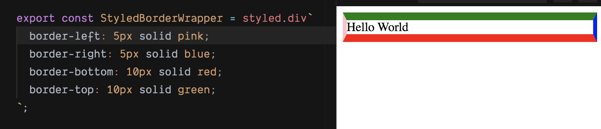

In `component.style.ts`

```javascript
import styled from 'styled-compoments';

export const StyledWrapperWithTriangle = styled.div`
  &:before {
    content: "";
    position: absolute;
    width: 0px;
    height: 0px;
    left: 0px;
    top: 10px;
    border-left: 5px solid transparent;
    border-right: 5px solid transparent;
    border-bottom: 10px solid red;
  }
`;
```

Then you will draw a triangle facing up with just css styling now!


### Why this works?
First of all, we ustilize `border`. We seldom think about how borders arrange around the element. What's gonna happen if we set 4 borders all diffrent colors?



Then, think about what if we make the content being wrapped smaller and smaller, until a 1px * 1px dot, then 0px * 0px invisible dot.

It will be 4 triangles putting together.

Then we set the other 3 triangles at the top, left and right as transparent.

Finally, we get a triangle we want. 

### A further question to think about
How to draw a triangle facing down by using just css styling?

.
.
.
.
.
.

Here is the answer:

```javascript
export const StyledWrapperWithTriangleDown = styled.div`
  &:before {
    content: "";
    position: absolute;
    width: 0px;
    height: 0px;
    left: 0px;
    top: 10px;
    border-left: 5px solid transparent;
    border-right: 5px solid transparent;
    border-top: 10px solid red;
  }
`;
```

### Wanna try today?
Here is a playground for with `style-components` installed. [https://codesandbox.io/s/rkmnrbye4?file=/Wrapper.js]

You can style your components from today! YAY!