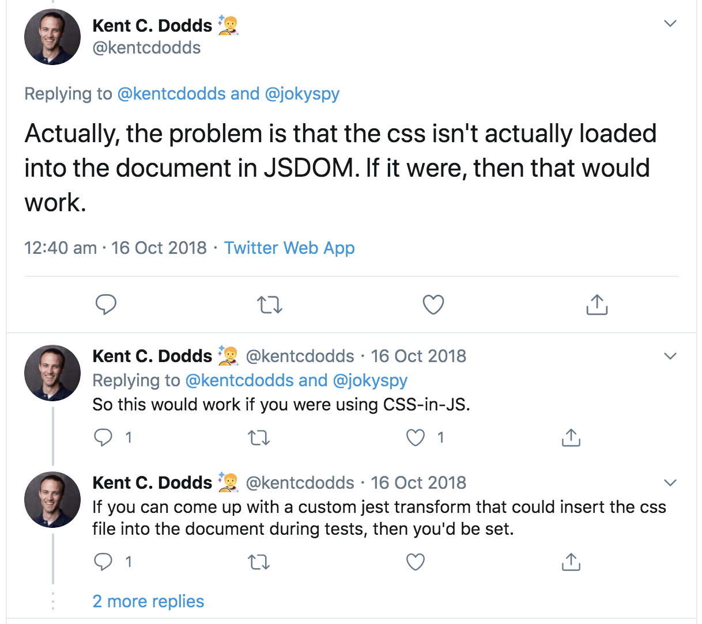

之前的文章中提到可以通过 set `display: none` 这样的 style 来控制 component 不显示。

```tsx
export const StyledContainer = styled.div`
  #page-print {
    display: none;
  }
  @media print {
    #page-print {
      display: block;
    }
    #page-screen {
      display: none;
    }
  }
`;

const page = () => {
  return (
    <StyledContainer>
      <div id="page-screen">I'm looking at the browser.</div>
      <div id="page-print">I'm printing.</div>
    </StyledContainer>
  );
};
```

### 但是要怎么样测试它呢？

看看下面的测试

```tsx
import { render } from "@testing-library/react";

const renderComponent = component => {
  return render({ compoent });
};

it("should not see print page when it is not print mode", () => {
  const { getByText } = renderComponent(<StyledContainer />);
  expect(getByText("I'm printing.")).not.toBeInTheDocument();
});
```

可以做到我们想做的吗？

上面的测试会fail哦！

因为print-page这个element还在DOM里面，在Document里面，只是设置了不display而已。

**而且**，这里有一个JSDOM limitation，css没有load到document里面。这个是`react-testing-library`的作者说的哦。



所以怎么办呢？ 这个stackOverflow的答案可能有帮助哦
[https://stackoverflow.com/questions/52813527/cannot-check-expectelm-not-tobevisible-for-semantic-ui-react-component]