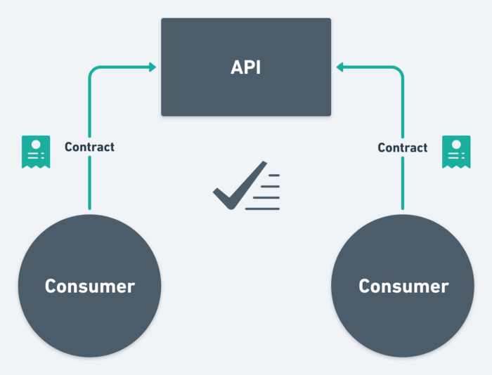

## 什么是contract test？

[reference: https://medium.com/better-practices/consumer-driven-contract-testing-using-postman-f3580dba5370](https://medium.com/better-practices/consumer-driven-contract-testing-using-postman-f3580dba5370)

Contract testing是一种确保两个系统可以兼容的一种测试方法，比如两个微服务之间。Contract记录了两个服务之间的互动，来确保两个系统都遵守了他们之间约定的合同。

> Contract testing is a methodology for ensuring that two separate systems (such as two microservices) are compatible with one other. It captures the interactions that are exchanged between each service, storing them in a contract, which can then be used to verify that both parties adhere to it.
[https://pactflow.io/blog/what-is-contract-testing/](https://pactflow.io/blog/what-is-contract-testing/)

## 听起来太抽象了？

其实就是比如一个别的组做的一个判断答案对错的API,答应我们组会返回给我们这样的结果
```json
{
    "code": "100",
    "isSuccess": true,
    "description": "Answers are correct"
}
```

我们答应用他们的API的时候，发送这样的body
```json
{
    "questionId": "101",
    "answer": "Yes"
}
```

比如约定code是个string，那么就不能返回number给我们，也不能返回null，undefined给我们。

我们答应answer是一个string，那么就不能发送boolean，或者number，或者null，undefined给他们。

把这些约定都记录在contract里面，如果任何一方有新的deployment打破了之前的约定，我们就可以知道哪里和之前不一样了。或者有error的时候可以很快排查是否因为contract被破坏而产生，有助于解决bug。

如果把contract test运行到pipeline上，设置一段时间自动运行一次，那么还可以提早知道，提供给我们服务的upstream，downstream是不是还和之前一样。反之一样，如果是API提供者，也可以测试自己每次改动升级是否还符合之前的contract。

## 分享其中一种用户驱动的contract testing的一种方法 （customer-driven contract testing）

有时候很难控制其他组是否进行contract testing，作为用这个API的组，我们依然可以只在我们这边做contract testing，也非常有帮助哦。

方法有很多很多。

这里具体的分享其中一种方法。

用他 => [https://www.npmjs.com/package/typescript-json-validator](https://www.npmjs.com/package/typescript-json-validator)

定义这样的types在src/Example.ts里面
```ts
export default interface ExampleType {
  value: string;
  /**
   * @TJS-format email
   */
  email?: string;
  /**
   * @default 42
   */
  answer: number;
}
```

然后可以轻松的生成validator哦
```
npx typescript-json-validator src/Example.ts ExampleType
```

然后就可以这样用这个validate function了哦
```ts
import {readFileSync} from 'fs';
import validate from './Example.validator.ts';
 
const value: unknown = JSON.parse(readFileSync(process.argv[2], 'utf8'));
 
// this will through a clear error if `value` is not of the
// correct type. It will also fill in any default values
const validatedValue = validate(value);
 
console.log(validatedValue.value);
```

如果别人break了contract我们这边就有error msg，可以具体的告诉我们是那个parameter变啦或者错啦。