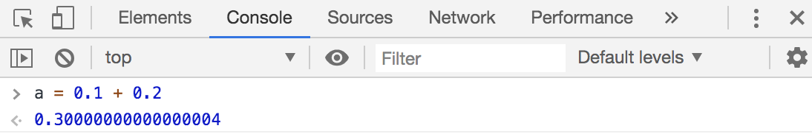

试试在JavaScript里面，运行`0.1 + 0.2`，输出结果。

结果是什么呢？我们心想，好简单哦，肯定是`0.3`呀~

运行一下, 有点惊讶哦，其实是...`0.30000000000000004`



### 为什么简单的有限小数点的小数相加，结果不是我们预期的呢？
因为电脑用来存储小数float的format是`binary floating point`。（我们都知道数字在计算机里面是用二进制存储的嘛，小数当然也一样了。）

而`binary floating point`根本不可能准确的代表像0.1, 0.2, 0.3 这样的数字。

就像`decimal number`不可能准确代表 1/3，`binary floating point`不可能准确代表0.1。他们都只是一种format而已。

### 怎么解决呢？
记得把他们约等于起来呀，固定小数点的位数呀！

固定小数点的个数，number是被操作的数字，x是小数点个数
```
number.toFixed(x)
```
这个方法返回的是一个**string**哦！

而且它是四舍五入的，不是trim掉后面的。

```js
3.14159.toFixed(2);              // 3.14 returns a string
3.14888.toFixed(2);              // 3.15 returns a string
parseFloat(3.14159.toFixed(2));  // 3.14 returns a number
```

想要向下约等于的话
```js
Math.floor(3.14888 * 100) / 100  // 3.14 return a number, digits after 4 are trimed
```


各种约等于
```js
Math.round(3.14159)  // 3
Math.round(3.5)      // 4
Math.floor(3.8)      // 3
Math.ceil(3.2)       // 4
```


####  Reference：

[https://floating-point-gui.de/basic/](https://floating-point-gui.de/basic/)

[https://pawelgrzybek.com/rounding-and-truncating-numbers-in-javascript/](https://pawelgrzybek.com/rounding-and-truncating-numbers-in-javascript/)